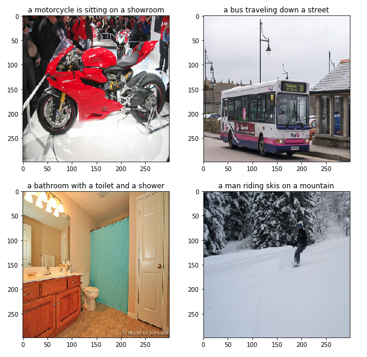

# Image captioning
Generate captions for any image using tensorflow

## Introduction
This project uses a convolution neural network (CNN) to extract features of image inputs which are then feeded to a recurrent neural network (RNN) to predict captions. 
Pretrained InceptionV3 network is used as the CNN encoder. RNN decoder consists of a single layered unidirectional GRU and dense layers. Beam search is used to pick the best caption from the decoder output.

## Dataset
[MS-COCO dataset](http://cocodataset.org/) is used for training purpose. 2017 train dataset consists of 118k images. Download and extract both the image and annotation datasets and place it in the project directory for training.

## Usage
Training: ```python train.py```

Evaluate: ```python evaluate.py -i <image path>```

## Sample output

